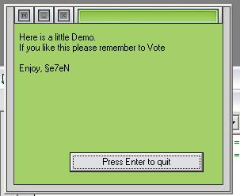



## Resizeable Skined Form

### Description

Here I am again With another skin Example, But this one is alot better then my last 2. this creates all the image controls and reads from a file to get the pics. yes i know i used the same skin as in the 1st one but i cant be bothered gettin another one. anyways please vote and comment
 
### More Info
 
Form Move stops mouse clicks

             |
---                |---
**Submitted On**   |2000-01-11 20:36:58
**By**             |[�e7eN](https://github.com/Planet-Source-Code/PSCIndex/blob/master/ByAuthor/e7en.md)
**Level**          |Beginner
**User Rating**    |4.8 (57 globes from 12 users)
**Compatibility**  |VB 5\.0, VB 6\.0
**Category**       |[Graphics](https://github.com/Planet-Source-Code/PSCIndex/blob/master/ByCategory/graphics__1-46.md)
**World**          |[Visual Basic](https://github.com/Planet-Source-Code/PSCIndex/blob/master/ByWorld/visual-basic.md)
**Archive File**   |[Resizeable14892110302002\.zip](https://github.com/Planet-Source-Code/e7en-resizeable-skined-form__1-40269/archive/master.zip)

